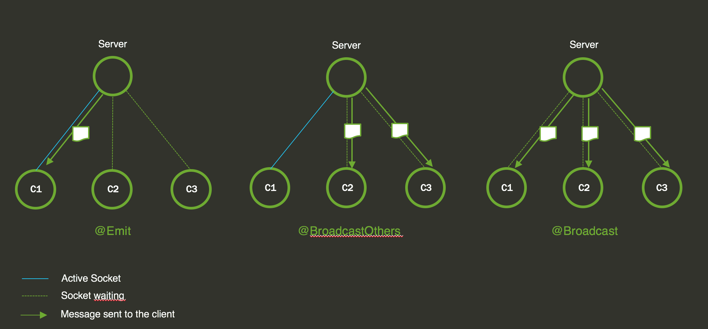

---
meta:
 - name: description
   content: Use Socket.io with Express, TypeScript and Ts.ED. Socket.io enable real-time bidirectional event-based communication. It works on every platform, browser or device, focusing equally on reliability and speed.
 - name: keywords
   content: ts.ed express typescript socket.io websocket node.js javascript decorators
---
# Socket.io <Badge text="beta" type="warn"/>

<Banner src="https://socket.io/css/images/logo.svg" href="https://socket.io" height="90" style="margin-left:-40px" />

Socket.io enable real-time bidirectional event-based communication. It works on every platform, browser or device, focusing equally on reliability and speed.

## Installation

Before using the Socket.io, we need to install the [Socket.io](https://www.npmjs.com/package/socket.io) module.

```bash
npm install --save socket.io @types/socket.io
```

Then add the following configuration in your [ServerLoader](/api/common/server/serverloader.md):

```typescript
import {ServerLoader, ServerSettings} from "@tsed/common";
import "@tsed/socketio"; // import socketio Ts.ED module

@ServerSettings({
    rootDir: __dirname,
    socketIO: {
        // ... see configuration
    }
})
export class Server extends ServerLoader {

}
```

## Configuration

- `path` &lt;string&gt;: name of the path to capture (/socket.io).
- `serveClient` &lt;boolean&gt;: whether to serve the client files (true).
- `adapter` &lt;Adapter&gt;: the adapter to use. Defaults to an instance of the Adapter that ships with socket.io which is memory based. See [socket.io-adapter](https://github.com/socketio/socket.io-adapter).
- `origins` &lt;string&gt;: the allowed origins (*).
- `parser` &lt;Parser&gt;: the parser to use. Defaults to an instance of the Parser that ships with socket.io. See [socket.io-parser](https://github.com/socketio/socket.io-parser).

For more information see [Socket.io documentation](https://socket.io/docs/server-api/#)

## Socket Service

> Socket.IO allows you to “namespace” your sockets, which essentially means assigning different endpoints or paths.
This is a useful feature to minimize the number of resources (TCP connections) and at the same time separate concerns within your application
 by introducing separation between communication channels. See [namespace documentation](https://socket.io/docs/rooms-and-namespaces/#).

All Socket service work under a namespace and you can create one Socket service per namespace.

Example:

```typescript
import * as SocketIO from "socket.io";
import {SocketService, IO, Nsp, Socket, SocketSession} from "@tsed/socketio";

@SocketService("/my-namespace")
export class MySocketService {

    @Nsp nsp: SocketIO.Namespace;
    
    @Nsp("/my-other-namespace") 
    nspOther: SocketIO.Namespace; // communication between two namespace


    constructor(@IO private io: SocketIO.Server) {}
    /**
     * Triggered the namespace is created
     */
    $onNamespaceInit(nsp: SocketIO.Namespace) {

    }
    /**
     * Triggered when a new client connects to the Namespace.
     */
    $onConnection(@Socket socket: SocketIO.Socket, @SocketSession session: SocketSession) {

    }
    /**
     * Triggered when a client disconnects from the Namespace.
     */
    $onDisconnect(@Socket socket: SocketIO.Socket) {

    }
}
```

> @SocketService inherit from @Service decorator. That means, a SocketService can be injected to another Service, Controller or Middleware.

Example:

```typescript
import * as SocketIO from "socket.io";
import {SocketService, Nsp} from "@tsed/socketio";

@SocketService()
export class MySocketService {
     @Nsp nsp: SocketIO.Namespace;

     helloAll() {
         this.nsp.emit('hi', 'everyone!');
     }
}
```
Then, you can inject your socket service into another Service, Controller, etc... as following:

```typescript
import {Controller, Get} from "@tsed/common";
import {MySocketService} from "../services/MySocketService";

@Controller("/")
export class MyCtrl {
   
    constructor(private mySocketService: MySocketService) {
         
    }

    @Get("/allo")
    allo() {
         this.mySocketService.helloAll(); 
         return "is sent";
    }
}
```

### Declaring an Input Event

[@Input](/api/socketio/input.md) decorator declare a method as a new handler for a specific `event`.

```typescript
import {SocketService, Input, Emit, Args, Socket, Nsp} from "@tsed/socketio";

@SocketService("/my-namespace")
export class MySocketService {
    @Input("eventName")
    myMethod(@Args(0) userName: string, @Socket socket: SocketIO.Socket, @Nsp nsp: SocketIO.Namespace) {
        console.log(userName);
    }
}
```

- [@Args](/api/socketio/args.md) &lt;any|any[]&gt;: List of the parameters sent by the input event.
- [@Socket](/api/socketio/socket.md) &lt;SocketIO.Socket&gt;: Socket instance.
- [@Nsp](/api/socketio/nsp.md) &lt;[SocketIO.Namespace](https://socket.io/docs/rooms-and-namespaces/#)&gt;: Namespace instance.

### Send a response

You have a many choice to send a response to your client. Ts.ED offer some decorators to send a response:



Example:

```typescript
import {SocketService, Input, Emit, Args, Socket, Nsp} from "@tsed/socketio";

@SocketService("/my-namespace")
export class MySocketService {
    @Input("eventName")
    @Emit("responseEventName") // or Broadcast or BroadcastOthers
    async myMethod(@Args(0) userName: string, @Socket socket: SocketIO.Socket) {
        return "Message " + userName;
    }
}
```
> The method accept a promise as returned value.

!> Return value is only possible when the method is decorated by [@Emit](/api/socketio/emit.md), [@Broadcast](/api/socketio/broadcast.md) and [@BroadcastOthers](/api/socketio/broadcastothers.md).

### Socket Session

Ts.ED create a new session for each socket.

```typescript
import {SocketService, Input, Emit, Args, SocketSession} from "@tsed/socketio";

@SocketService("/my-namespace")
export class MySocketService {
    @Input("eventName")
    @Emit("responseEventName") // or Broadcast or BroadcastOthers
    async myMethod(@Args(0) userName: string, @SocketSession session: SocketSession) {

        const user = session.get("user") || {}
        user.name = userName;

        session.set("user", user);

        return user;
    }
}
```

### Middlewares

A middleware can be also used on a `SocketService` either on a class or on a method.

Here an example of a middleware:

```typescript
import {ConverterService} from "@tsed/common";
import {SocketMiddleware, Args} from "@tsed/socketio";
import {User} from "../models/User";

@SocketMiddleware()
export class UserConverterSocketMiddleware {
    constructor(private converterService: ConverterService) {
    }
    async use(@Args() args: any[]) {
        
        let [user] = args;
        // update Arguments
        user = this.converterService.deserialize(user, User);

        return [user];
    }
}
```
> The user instance will be forwarded to the next middleware and to your decorated method.

You can also declare a middleware to handle an error with `@SocketMiddlewareError`.
Here an example:

```typescript
import {SocketMiddlewareError, SocketErr, SocketEventName, Socket, Args} from "@tsed/socketio";

@SocketMiddlewareError()
export class ErrorHandlerSocketMiddleware {
    async use(@SocketEventName eventName: string, @SocketErr err: any, @Socket socket: SocketIO.Socket) {
        console.error(err);
        socket.emit("error", {message: "An error has occured"})
    }
}
```

Two decorators are provided to attach your middleware on the right place:

- `@SocketUseBefore` will call your middleware before the class method,
- `@SocketUseAfter` will call your middleware after the class method.

Both decorators can be used as a class decorator or as a method decorator.
The call sequences is the following for each event request:

- Middlewares attached with `@SocketUseBefore` on class,
- Middlewares attached with `@SocketUseBefore` on method,
- The method,
- Send response if the method is decorated with `@Emit`, `@Broadcast` or `@BroadcastOther`,
- Middlewares attached with `@SocketUseAfter` on method, 
- Middlewares attached with `@SocketUseAfter` on class.

Middlewares chain use the `Promise` to run it. If one of this middlewares/method emit an error, the first middleware error will be called.

```typescript
import {SocketService, SocketUseAfter, SocketUseBefore, Emit, Input, Args} from "@tsed/socketio";
import {UserConverterSocketMiddleware, ErrorHandlerSocketMiddleware} from "../middlewares";
import {User} from "../models/User";

@SocketService("/my-namespace")
@SocketUseBefore(UserConverterSocketMiddleware) // global version
@SocketUseAfter(ErrorHandlerSocketMiddleware)
export class MySocketService {
    
    @Input("eventName")
    @Emit("responseEventName") // or Broadcast or BroadcastOthers
    @SocketUseBefore(UserConverterSocketMiddleware)
    @SocketUseAfter(ErrorHandlerSocketMiddleware)
    async myMethod(@Args(0) user: User) {

        console.log(user);

        return user;
    }
}
```

## Decorators

<ApiList query="module === '@tsed/sockeio' && symbolType === 'decorator'">

